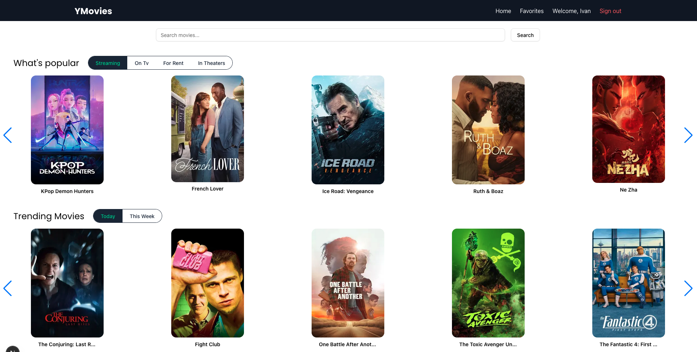

# YMovies

 

YMovies is a modern movie app built with **Next.js 13**, allowing users to browse, search, and favorite movies. The application integrates with TMDB API to fetch movie data, display trailers, cast information, and more.

---

## Features

- Browse trending movies by category (Streaming, On TV, For Rent, In Theaters)
- Search for movies by title
- View movie details including overview, release date, runtime, genres, and trailers
- Top billed cast carousel
- User authentication (Sign Up / Sign In)
- Add or remove movies from favorites
- Responsive design for desktop and mobile devices

---

## Technologies Used

- **Next.js** (App Router)
- **TypeScript**
- **Tailwind CSS**
- **Redux Toolkit** for state management
- **React Hot Toast** for notifications
- **RTK Query** for data fetching and cashing
- **Swiper.js** for carousel
- **TMDB API** for movie data
- **Lucide Icons** for UI icons
- **Better-Auth** for authentication
---

## Installation

1. Clone the repository:

```bash
git clone https://github.com/ComradeUa/Ymove.git
cd Ymove
```
2. Install dependencies:

```bash
npm install
# or
yarn
```

3. Create .env file with your TMDB API key and authentication settings:

```env
TMDB_API_KEY=your_api_key
DATABASE_URL=your_database_url
BETTER_AUTH_SECRET=your_better_auth_secret_key
BETTER_AUTH_URL=http://localhost:3000
GITHUB_CLIENT_SECRET=your_github_client_secret_key
GITHUB_CLIENT_ID=your_github_client_id
RESEND_API_KEY=your_resend_api_key
```
4. Run the development server:

```bash
npm run dev
# or
yarn dev
```

## Usage

1. **Sign Up / Sign In**  
   - Create an account or log in to save your favorite movies.  
   - If needed, **resend email verification** for a smoother authentication experience.

2. **Browse Movies**  
   - Explore trending movies by category: Streaming, On TV, For Rent, or In Theaters.  
   - Use the search bar to find movies by title.

3. **Movie Details**  
   - Click on a movie to view detailed information, including overview, release date, runtime, genres, and trailer.

4. **Favorites**  
   - Add movies to your favorites by clicking the heart icon.  
   - Manage your favorite movies list anytime.

5. **Top Billed Cast**  
   - Explore the main actors of a movie using the carousel.

6. **Responsive Design**  
   - Fully responsive UI optimized for both mobile and desktop devices.

## Folder Structure

```
src/
├─ components/ # Reusable React components
├─ hooks/ # Custom hooks for fetching data
├─ store/ # Redux Toolkit slices and RTK Query APIs
├─ pages/ or app/ # Next.js pages (depending on App Router)
└─ types/ # TypeScript types
```

## License

This project is licensed under the MIT License.